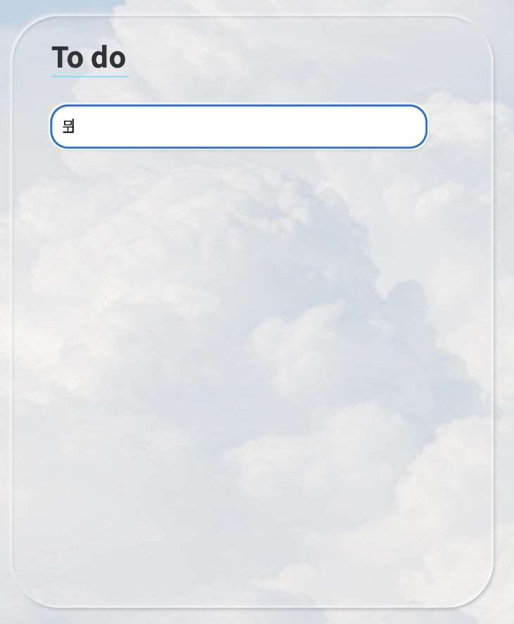

### **My Web**
---
My Web를 통해 사용자가 타이머, 테트리스게임, 체크리스트를 할 수 있고 시간과 날짜를 확인할 수 있다.

<br>

### **- Stacks**
---


**바닐라 JavaScript를 사용한 이유**<br>
학습한 자바스크립트 내용을 다시 한 번 익히고 활용하기 위해 선택했다.
<br>

### **- Functions**
---
1. 닉네임 입력(로그인)
2. 날짜, 시간, 로그아웃, 다크모드(라이트모드), 명언
3. 테트리스 게임 (점수 제공, 리셋)
4. 타이머 (시간설정, 스톱, 리셋)
5. 북마크 (해당 사이트로 이동)
6. 투두리스트 (추가, 삭제)
<br>

### **- Demo**
---
### 1. 닉네임 입력(로그인)

<br><br>

### 2. 다크모드, 라이트모드


매번 배경이 랜덤으로 생성
<br><br>

### 3. 테트리스 게임, 타이머 (시간설정, 스톱, 리셋)


<br><br>

### 5. 북마크 (해당 사이트로 이동)

<br><br>

### 6. 투두리스트 (추가, 삭제)

<br><br>

### 7. 로그아웃


<br>

### **- I Learned It**
---
## 1. target과 currentTarget의 차이
todolist에서 삭제할 때 삭제 버튼을 누르는데 삭제가 될 때도 있고 안 될 때도 있었다.
```javascript
function deleteToDo(event) {
    let li = event.target.parentElement;
    li.remove();
    toDos = toDos.filter((toDo) => toDo.id !== parseInt(li.id));
    saveToDos();
}
```
해당 삭제 버튼은 버튼 안에 아이콘이 있는 형태였는데 target으로 해둔 상태라서 아이콘을 선택 시에는 해당 todo가 삭제가 안되고 버튼에서 아이콘이 차지하는 위치가 아닌 곳을 클릭하면 todo가 삭제되는 것이었다.

그래서
```javascript
function deleteToDo(event) {
    let li = event.target.parentElement;
    li.remove();
    toDos = toDos.filter((toDo) => toDo.id !== parseInt(li.id));
    saveToDos();
}
```
currentTarget으로 변경하였더니 버튼을 누르면 잘 작동한다!

- target : 이벤트가 발생된 요소
- currentTarget : 이벤트 핸들러와 연결된 요소